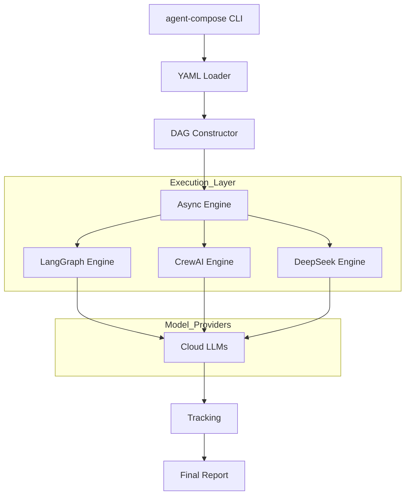

<div align="center">

# 🌌 agent-compose

**The Orchestrator for the Agentic Era.**

🚀 *One YAML. Any Framework. Infinite Scale.*

[](LICENSE)
[](https://python.org)
[](https://deepseek.com)
[]()

---

**Build multi-agent AI systems like you build infrastructure with Docker Compose.**  
Stop writing brittle orchestration glue code. Define your topology in YAML and ship.

[Quick Start](#-quick-start) • [Why agent-compose?](#-the-philosophy) • [DeepSeek Mastery](#-deepseek-integration) • [Architecture](#-core-architecture)

</div>

---

## 💎 The Philosophy

Multi-agent development is currently in its "Manual Era." Teams spend 70% of their time writing orchestration logic—handling state, resolving dependencies, and tracking costs. 

**agent-compose** brings order to the chaos. It is the first framework-agnostic orchestrator that allows you to mix **LangGraph**, **CrewAI**, and **OpenAI SDK** agents in a single, declarative pipeline.

### **The "Killer Feature": Framework Mixing**
Prototype an agent in CrewAI, refine another in LangGraph, and keep a simple generating agent as a raw LLM call. **agent-compose** handles the data flow, dependency resolution, and parallel execution.

---

## ⚡ Quick Start

### **1. Install**
```bash
pip install agent-compose[all]
```

### **2. Define `agent-compose.yaml`**
```yaml
name: executive-research-pipeline
description: "LangGraph (Research) → CrewAI (Analysis) → DeepSeek (Writing)"

agents:
  researcher:
    framework: langgraph
    model: deepseek-chat
    system_prompt: "Thoroughly research the given topic and extract data points."
    tools: [web_search]
    connects_to: [analyst]

  analyst:
    framework: crewai
    role: "Senior Strategic Analyst"
    goal: "Extract competitive insights and second-order effects."
    model: deepseek-chat
    connects_to: [writer]

  writer:
    framework: raw
    model: deepseek-chat
    system_prompt: "Transform findings into a C-Suite executive brief."
    output: report.md
```

### **3. Launch**
```bash
# Set your key
export DEEPSEEK_API_KEY="your_api_key"

# Run the pipeline
agent-compose up --input "The state of AI orchestration in 2026"
```

---

## 🥷 DeepSeek Native Integration

In 2026, **cost-efficiency is the differentiator.** agent-compose is optimized for DeepSeek's high-performance, low-cost reasoning.

- **Unified Billing**: Track per-agent token costs even when mixing providers.
- **BaseURL Auto-Routing**: Automatically routes to `api.deepseek.com` when a `deepseek-*` model is detected.
- **Failover Support**: Gracefully fallback from expensive flagship models to DeepSeek if budgets are exceeded.

---

## 🏗️ Core Architecture (FAANG-Spec)



---

## 🛠️ CLI Reference

| Command | Description |
| :--- | :--- |
| `up` | Spin up the entire pipeline (Parallel by default). |
| `validate` | Perform strict schema validation and cycle detection. |
| `graph` | Visualize the agent topology in ASCII or Mermaid. |
| `run <agent>` | Debug a single agent in isolation with custom input. |
| `costs` | View full token and USD breakdown of the last run. |

---

## 🤝 Contributing

We welcome senior-level contributions to the core engine. Check [CONTRIBUTING.md](CONTRIBUTING.md) for our engineering standards (Type hints, Pytest coverage, and Architectural clean-code).

---

<div align="center">

**[agent-compose](https://github.com/Ismail-2001/agent-compose)** by **Ismail Sajid**

*Write YAML. Ship Agents.*

</div>
